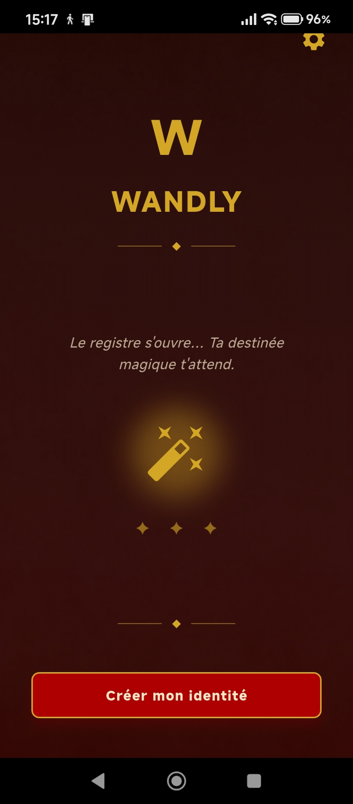
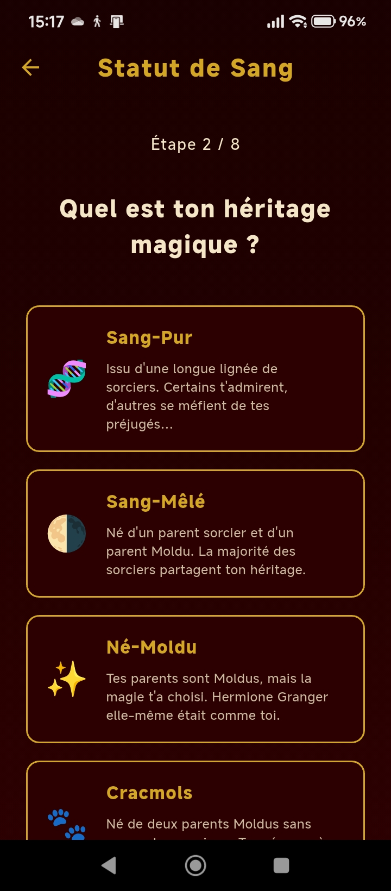
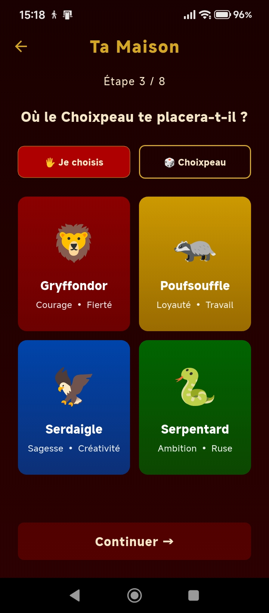
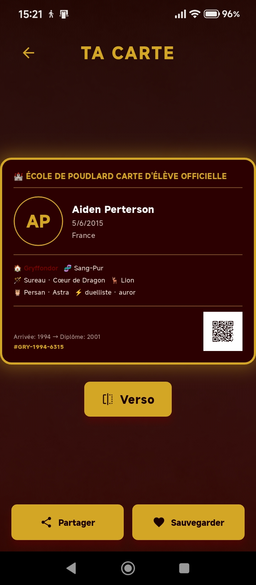

# 🪄 Wandly

> Crée ton identité de sorcier et génère ta carte d'élève de Poudlard


---

## 📱 Aperçu

Wandly est une application Flutter sur l'univers Harry Potter. En 8 étapes, tu crées ton identité de sorcier complète — maison, baguette, patronus, statut de sang — et tu obtiens une carte d'élève officielle de Poudlard avec QR code, partageable et sauvegardable.

## ✨ Fonctionnalités

- **Création d'identité en 8 étapes** — Nom, date de naissance, pays, statut de sang, maison, baguette, patronus, spécialités
- **Choix de maison** — Gryffondor, Poufsouffle, Serdaigle, Serpentard (manuel ou via le Choixpeau)
- **Statut de sang** — Sang-Pur, Sang-Mêlé, Né-Moldu, Cracmols
- **Carte d'élève officielle** — Carte générée avec toutes les infos, QR code unique et numéro d'identification
- **Recto / Verso** — Carte à deux faces
- **Partage** — Partage de la carte via les apps du téléphone
- **Sauvegarde locale** — Données persistantes via Hive
- **Splash screen & icônes adaptatives** — Onboarding soigné

## 📋 Informations sur la carte

Chaque carte générée contient :
- Nom, date de naissance, pays
- Maison & statut de sang
- Baguette (bois + cœur)
- Patronus & familier
- Spécialités (duelliste, auror…)
- Années d'arrivée et de diplôme
- Numéro d'identification unique
- QR code personnel

## 🛠️ Stack technique

| Catégorie | Technologie |
|---|---|
| Framework | Flutter / Dart |
| Stockage local | Hive + hive_flutter |
| Image | image_picker + image_cropper |
| QR Code | qr_flutter |
| Partage | share_plus |
| Permissions | permission_handler |
| Splash screen | flutter_native_splash |

## 📸 Captures d'écran

| Accueil | Statut de Sang | Ta Maison | Ta Carte |
|---|---|---|---|
|  |  |  |  |

## 🚀 Installation

```bash
# Cloner le dépôt
git clone https://github.com/julieinfo/wandly.git
cd wandly

# Installer les dépendances
flutter pub get

# Lancer l'application
flutter run
```

> ℹ️ Aucune configuration externe requise — toutes les données sont stockées localement.

## 📋 Prérequis

- Flutter SDK ≥ 3.0
- Dart ≥ 3.0

## 👩‍💻 Auteure

**Julie de Castro** — Développeuse Flutter  
[GitHub](https://github.com/julieinfo) · [Portfolio](https://julieinfo.github.io)
